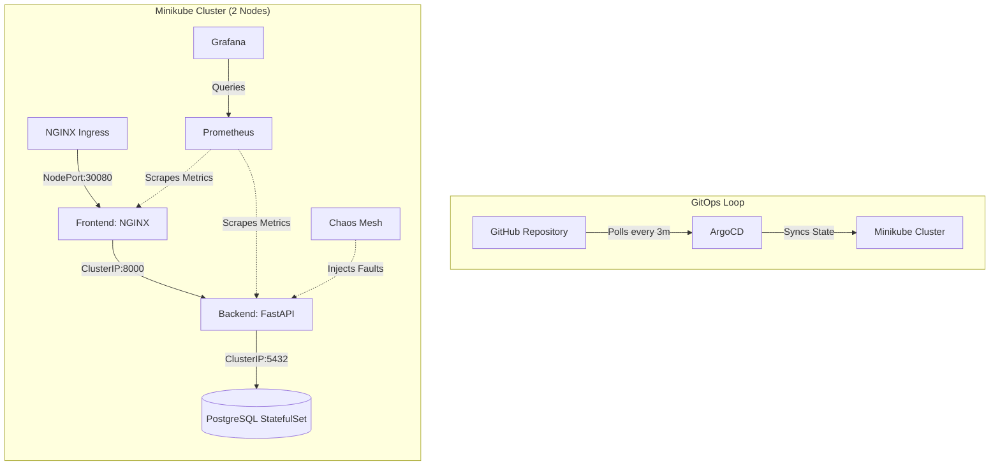
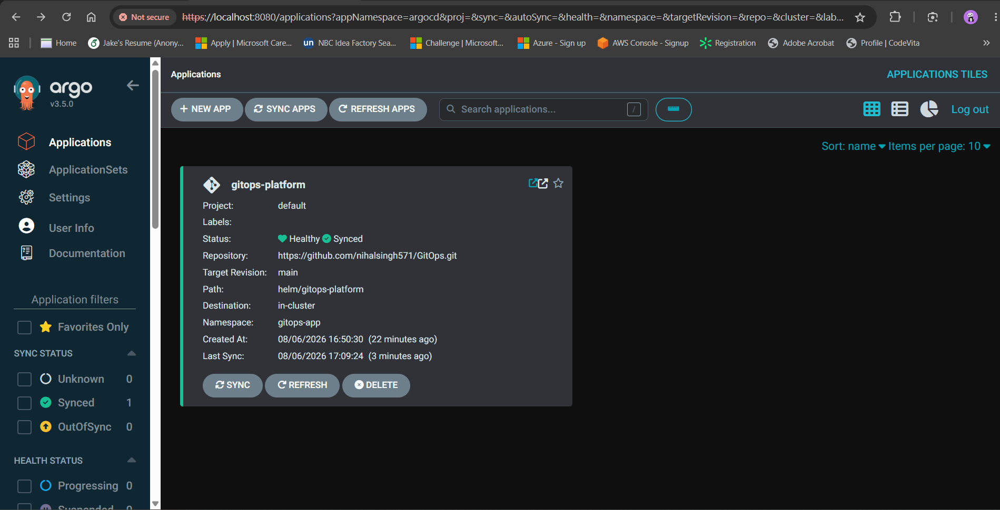
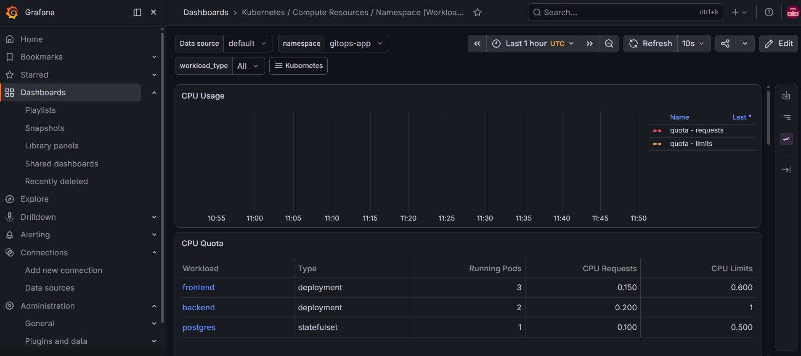
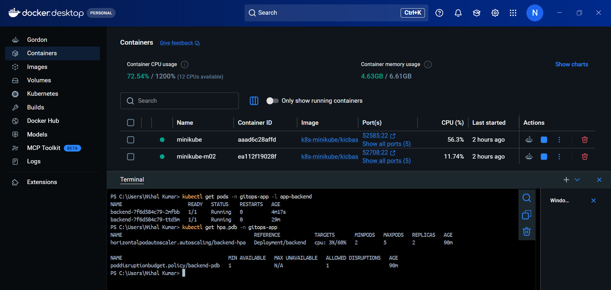
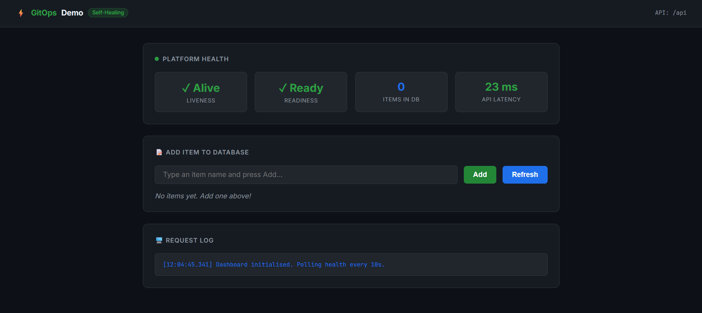
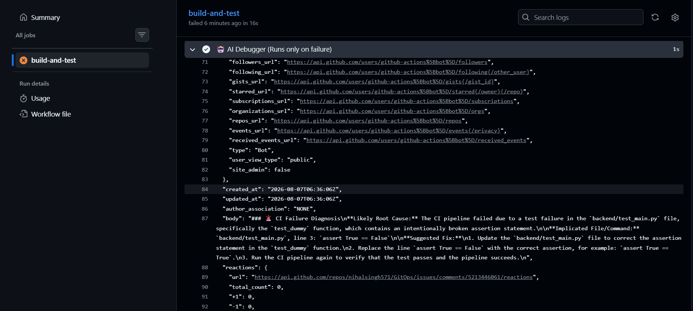

# Chaos-Engineered Self-Healing GitOps Platform 🚀

[](https://kubernetes.io/)
[](https://argo-cd.readthedocs.io/)
[](https://chaos-mesh.org/)
[](https://grafana.com/)
[](https://fastapi.tiangolo.com/)

A portfolio-grade, zero-cloud-cost Kubernetes platform built on Minikube. This project demonstrates modern SRE and DevOps practices including **GitOps-driven Continuous Delivery**, **Observability**, and **Chaos Engineering**.

---

## 🏗️ Architecture



## 🛠️ Tech Stack & Key Concepts
- **Infrastructure:** Minikube (2-node cluster), Docker Desktop (WSL2).
- **Application:** 3-Tier architecture (NGINX Frontend, Python/FastAPI Backend, PostgreSQL StatefulSet).
- **GitOps:** ArgoCD (Automated syncing, pruning, and self-healing from Git).
- **Resilience (K8s Native):** 
  - `HorizontalPodAutoscaler` (HPA) for CPU-based scaling.
  - `PodDisruptionBudget` (PDB) to guarantee minimum availability during disruptions.
  - `Liveness` & `Readiness` probes gating traffic.
- **Observability:** `kube-prometheus-stack` (Prometheus + Grafana).
- **Chaos Engineering:** Chaos Mesh (Injecting automated pod kills to prove MTTR).

---

## 📸 Platform Highlights

### 1. GitOps Automated Delivery (ArgoCD)
The entire platform is declaratively managed by ArgoCD. No `kubectl apply` is used in production.


### 2. Full Observability (Grafana)
CPU, Memory, and Pod health are scraped by Prometheus and visualized in real-time.


### 3. Self-Healing Resilience (HPA, PDB, & Chaos Mesh)
When Chaos Mesh assassinates a pod, the ReplicaSet instantly replaces it. The PodDisruptionBudget ensures zero downtime.

*(Above: Proof of pod replacement (4m vs 29m age) alongside active HPA and PDB configurations).*

### 4. Live 3-Tier Application


### 5. AI-Assisted CI Debugging 🤖
To reduce Mean Time To Recovery (MTTR) during development, this repository features an automated, GenAI-powered CI Debugger.
- **Zero Cost:** Uses GitHub Actions free tier and Groq's free API (`llama-3.1-8b-instant`).
- **Security & Air-Gapping:** A Python script sanitizes and redacts all logs (stripping tokens, passwords, and API keys) *before* sending them to the LLM. 
- **Design Boundary:** The AI is strictly **suggestion-only**. It posts root-cause analysis as a PR comment but is mathematically prevented from auto-committing fixes or merging code.



---

## 🚀 How to Run Locally

### 1. Prerequisites
- Docker Desktop (WSL2) with at least 6GB RAM allocated.
- Minikube (`minikube start --nodes 2 --cpus 2 --memory 6144`)
- Helm & Kubectl

### 2. Bootstrap GitOps
```bash
# 1. Install ArgoCD
kubectl create namespace argocd
kubectl apply -n argocd -f https://raw.githubusercontent.com/argoproj/argo-cd/stable/manifests/install.yaml

# 2. Apply the Application Manifest
kubectl apply -f argocd/application.yaml
```
ArgoCD will automatically read this repository and deploy the Helm chart found in `helm/gitops-platform/`.

### 3. Observability & Chaos
```bash
# Install Prometheus Stack
helm repo add prometheus-community https://prometheus-community.github.io/helm-charts
helm install prometheus prometheus-community/kube-prometheus-stack -n monitoring --create-namespace -f monitoring-values.yaml

# Install Chaos Mesh
helm repo add chaos-mesh https://charts.chaos-mesh.org
helm install chaos-mesh chaos-mesh/chaos-mesh -n chaos-mesh --create-namespace --set chaosDaemon.runtime=containerd --set chaosDaemon.socketPath=/run/containerd/containerd.sock --version 2.7.0

# Trigger a Chaos Experiment
kubectl apply -f chaos/pod-kill.yaml
```
